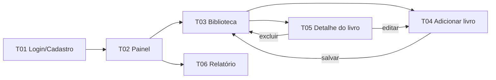

# Protótipos e Identidade Visual — Estante

> Entregável 8 da Fase 1 (**Protótipos e identidade**) · Desenvolvimento Web · Ciência da Computação, 4º semestre
> Alunas: Isabella Silva e Sena, Luísa Castro Souza e Maria Eduarda Almeida Campelo · Professor: Felippe Pires Ferreira

## 1. Conceito e nome

**Estante** remete ao móvel onde guardamos e organizamos livros, traduzindo diretamente o propósito do sistema: centralizar a biblioteca pessoal e o hábito de leitura (Documento de Visão, seções 1 e 14). O tom visual é **acolhedor, editorial e organizado**, com cores de papel e lombadas, evitando a aparência de painel corporativo.

Slogan: *Sua biblioteca, seu ritmo.*

## 2. Logotipo


Arquivo-fonte editável: [`logo.svg`](logo.svg). O símbolo é uma estante com quatro lombadas (a última inclinada, sugerindo um livro sendo retirado/lido) sobre um fundo verde arredondado, usável como ícone/favicon. A assinatura combina o símbolo com a palavra *Estante* em Fraunces.

## 3. Paleta de cores

| Cor | Nome | HEX | Uso |
|---|---|---|---|
|  | Verde Lombada | `#1F4D3F` | Cor primária, navegação, títulos |
|  | Verde Folha | `#2E6B58` | Variação primária, barras de progresso |
|  | Terracota Marcador | `#C8553D` | Ações principais (botões), destaques |
|  | Ouro Marca-página | `#D9A441` | Foco, progresso, alertas leves |
|  | Papel | `#FAF5EA` | Fundo geral |
|  | Tinta | `#1E2A28` | Texto principal |
|  | Cinza Sépia | `#6B7770` | Texto secundário |

Os status de leitura usam cores de apoio: **Lido** (verde), **Lendo** (âmbar), **Quero ler** (violeta suave), **Abandonado** (vermelho suave). O status também é indicado por texto, nunca apenas por cor.

## 4. Tipografia

| Função | Fonte | Observação |
|---|---|---|
| Títulos e números de destaque | **Fraunces** (600/700) | Serifada, remete a edição de livros. Fallback: Georgia |
| Texto, formulários e tabelas | **Inter** (400/500/600) | Alta legibilidade em telas. Fallback: Arial |

Ambas são distribuídas sob a licença SIL Open Font License e carregadas via Google Fonts.

## 5. Protótipo navegável

Arquivo: [`prototipo-estante.html`](prototipo-estante.html). Basta abri-lo no navegador (não requer servidor nem instalação). A navegação entre telas funciona pelos botões e menus. O layout é responsivo e o relatório possui folha de estilos de impressão (`Ctrl+P`).

### Fluxo entre telas



### Telas e rastreabilidade

| Tela | Descrição | Requisitos do Documento de Visão atendidos |
|---|---|---|
| **T01** Login/Cadastro | Autenticação e criação de conta, com mensagem de erro de validação | 7.1 Gerenciamento de usuários; restrições de autenticação e tratamento de erros |
| **T02** Painel | Meta anual, livro em leitura e indicadores resumidos | 7.4 Acompanhamento; 7.5 Meta anual |
| **T03** Biblioteca | Listagem em estante com busca e filtros por título/autor, gênero, status e nota | 7.2 Gerenciamento de livros; 7.3 Pesquisa e filtros |
| **T04** Adicionar livro | Busca na Open Library, importação, revisão/edição dos dados e aviso de indisponibilidade com alternativa manual | 7.2; 7.8 Integração externa; risco "Indisponibilidade da Open Library" |
| **T05** Detalhe do livro | Dados do livro, status, nota, progresso, registro e histórico de sessões, editar e excluir | 7.2; 7.4 Acompanhamento das leituras |
| **T06** Relatório | Filtros, 8 indicadores, tabela, exportação CSV e impressão | 7.6 Relatórios; objetivos de exportação CSV e impressão |

Todos os dados exibidos são fictícios.

## 6. Decisões de usabilidade

- Telas essenciais em no máximo dois cliques a partir do painel.
- Formulários com rótulos visíveis, campos obrigatórios marcados com `*` e mensagens de erro próximas ao campo.
- Importação da Open Library sempre seguida de etapa de **revisão**, evitando salvar dados incompletos.
- Contraste de texto sobre fundo ajustado para leitura confortável e foco de teclado visível.

## 7. Estrutura no repositório

```
docs/prototipos/
├── README.md
├── logo.svg
└── prototipo-estante.html
```
